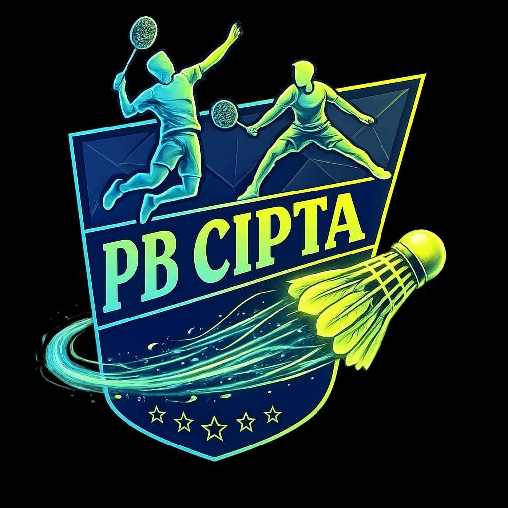

# PB.CIPTA BADMINTON LEAGUE

## Deskripsi
**PB.CIPTA BADMINTON LEAGUE** adalah aplikasi web modern yang dirancang khusus untuk mengelola kompetisi, peringkat, dan pembagian tim dalam olahraga bulu tangkis secara profesional dan adil. Aplikasi ini ditujukan untuk mengakomodasi kegiatan turnamen atau liga jangka panjang dengan pendataan statistik otomatis.

## Fitur Utama
- **Sistem Autentikasi Tertutup**: Perlindungan halaman (*route protection*) dengan sistem Login dan Register yang terintegrasi. Sesi tersimpan otomatis dan aman di perangkat.
- **Match Center**: Sistem pencatatan hasil pertandingan secara *real-time*.
- **Team Shuffle (Logic Engine)**: Algoritma cerdas untuk mengacak tim yang menyeimbangkan rotasi pemain. Mendukung status **REST** (Istirahat), memprioritaskan pemain yang belum main, dan minimal 4 pemain.
- **Global Rankings**: Papan peringkat interaktif yang menghitung poin, total kemenangan (Win Rate), dan atribut statistik tiap pemain secara otomatis dari *database*.
- **Match History & Logs**: Log riwayat pertandingan yang komprehensif. Admin dapat menghapus satu riwayat atau membersihkan (*Clear All*) seluruh riwayat sekaligus tanpa merusak poin pemain.
- **Live Notifications**: Peringatan (*alerts*) dan notifikasi pertandingan yang dinamis secara langsung.
- **Role-Based Admin Control**: Hak akses khusus Admin untuk me-reset hitungan *match* dan mengatur logo resmi liga.
- **Responsive & Premium UI**: Tampilan visual yang futuristik, animasi *micro-interaction* yang elegan, dan tata letak yang sempurna untuk perangkat HP (*mobile*) maupun Desktop.

## Teknologi yang Digunakan
- **Frontend Framework**: [React.js](https://react.dev/) dengan *build tool* [Vite](https://vitejs.dev/)
- **Styling & UI**: [Tailwind CSS](https://tailwindcss.com/), [Framer Motion](https://www.framer.com/motion/) (Animasi), Lucide React (Ikon)
- **Backend & Database**: [Supabase](https://supabase.com/) (PostgreSQL & Authentication)
- **Bahasa Pemrograman**: TypeScript (TSX)

## Pembuat Web
Web ini dirancang dan dikembangkan secara eksklusif oleh:

- **Nama**: Faris Raja Ardana
- **Email**: farisraja003@gmail.com
- **No. Telepon**: 085881971927

### About Me
Saya adalah lulusan **Ilmu Komputer, Universitas Pakuan Bogor**. Saya sangat antusias di bidang *Software Engineering* dan pengembangan antarmuka web yang modern. Aplikasi ini saya buat sebagai wujud penerapan logika algoritma (terutama pada fitur *matchmaking*) serta perancangan *User Experience* (UX) yang sangat interaktif dan efisien untuk digunakan secara langsung di lapangan pertandingan.
